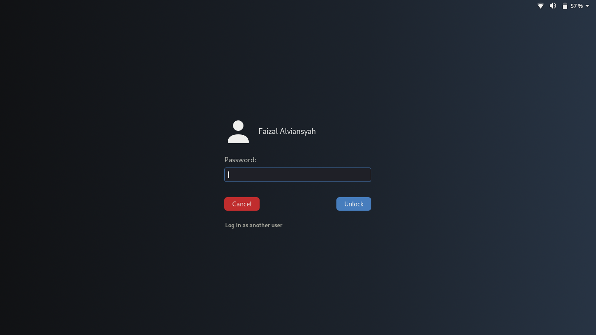

<h1 style="text-align: center">My cool GDM theme</h1>
* Gnome 3.30
 
 
Preview:

This is for my personal use (actually), but if you want to use it, you need to build the .gresource first and replace the default .gresource located in /usr/share/gnome-shell (backup the original file).
 
:smile: